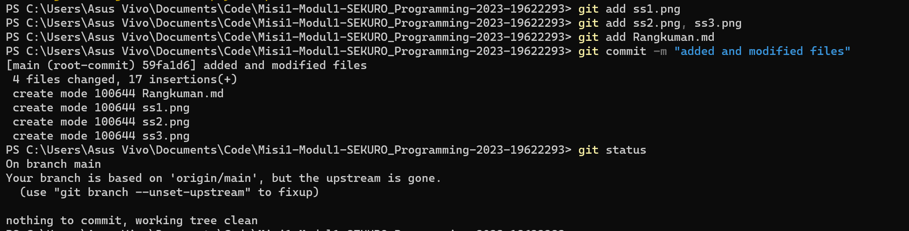
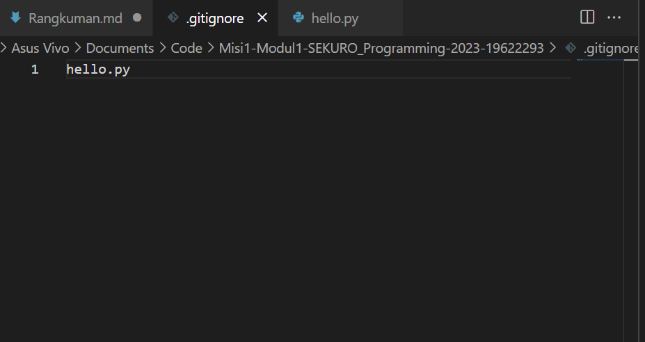

# Version Control System
version control system adalah sebuah sistem yang dapat mengelola perubahan dalam dokumen.Salah satu software version control system adalah Git dan versi websitenya adalah GitHub.
# Cara Menggunakan Git
Git terbagi menjadi tiga area, yakni working tree, staging area, dan history. Berikut langkah-langkah menggunakan Git:
1. Download Git melalui website dan jalankan pada perangkat lokal
2. gunakan command *git init* untuk membuat repository lokal sebagai working tree 
3. gunakan command *git add* untuk menambahkan file atau folder menuju staging area
4. Selanjutnya, gunakan command *git commit* untuk merekam semua aktivitas atau perubahan ke history
5. Terakhit, kita dapat menggunakan command *git status* untuk melihat apakah perubahan sudah disimpan atau commit  

sebelum add & commit
   

sesudah add & commit  
   

# Cara menggunakan GitHub
## 1. Membuat Repository di GitHub
Untuk menggunakan GitHub, diperlukan Login terlebih dahulu.
Lalu, kita dapat membuat repository yang dapat menyimpan file   
  
## 2. Membuat cloning ke lokal
Gunakan command *git clone [path dari github]*. Dengan begitu, remote di GitHub akan dihubungkan ke lokal sebagai clone repopsitory.

## 3. Push dan Pull
Membuat cloning ke lokal dari GitHub disebut pull. Sebaliknya, mengupdate online repository dari repository lokal disebut push. Kita dapat mengupdate repository di GitHub dengan comman *git push*.  

## 3. Branch
Terdapat suatu tool yang dapat dimanfaatkan dalam mencoba fitur, yakni branch. Kita dapat menggunakan branch untuk menguji fitur dan merge ke dalam branch utama atau master jika sudah yakin.
  
## Merge
Digunakan untuk menyatukan cabang atau branch ke cabang utama atau main. Akan tetapi, dapat terjadi error ketika penggabungan atau merge, yakni conflict. Untuk mengatasiya, diperlukan perubahan file secara manual.  

## Apa itu Fork ?
 Selain itu, tedapat tool fork, yakni alat yang digunakan untuk mencopy repository orang lain dan diubah di dalam repository kita.  
 ## .gitignore
 file dengan extension .gitignore adalah file dapat kita isi dengan nama file yang ingin diabaikan dan tidak dimasukkan   dalam repository  
 
   

 pada kasus di atas, file hello.py akan diabaikan
