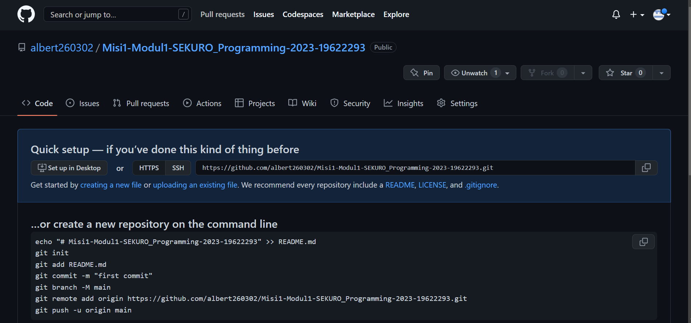

# Cara menggunakan GitHub
## 1. Membuat Repository di GitHub
Untuk menggunakan GitHub, diperlukan Login terlebih dahulu.
Lalu, kita dapat membuat repository yang dapat menyimpan file   
  
## 2. Membuat file baru  
Tekan tombol *add file* dan *create new file*. Setelah file terbuat, lakukan *commit* untuk menyimpannya dan history perubahan repository
