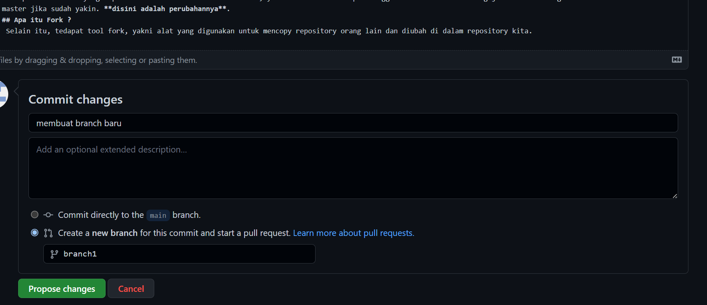
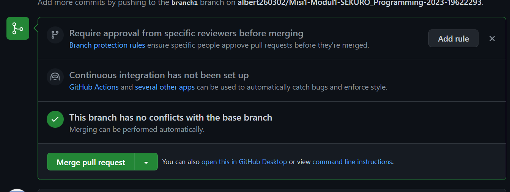

# Branch
Terdapat suatu tool yang dapat dimanfaatkan dalam mencoba fitur, yakni branch. Kita dapat menggunakan branch untuk menguji fitur dan merge ke dalam branch utama atau master jika sudah yakin.  

  
# Merge
Digunakan untuk menyatukan cabang atau branch ke cabang utama atau main. Akan tetapi, dapat terjadi error ketika penggabungan atau merge, yakni conflict. Untuk mengatasiya, diperlukan perubahan file secara manual.  
