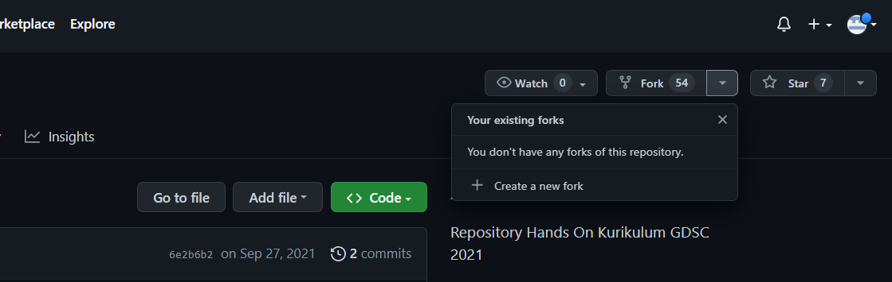
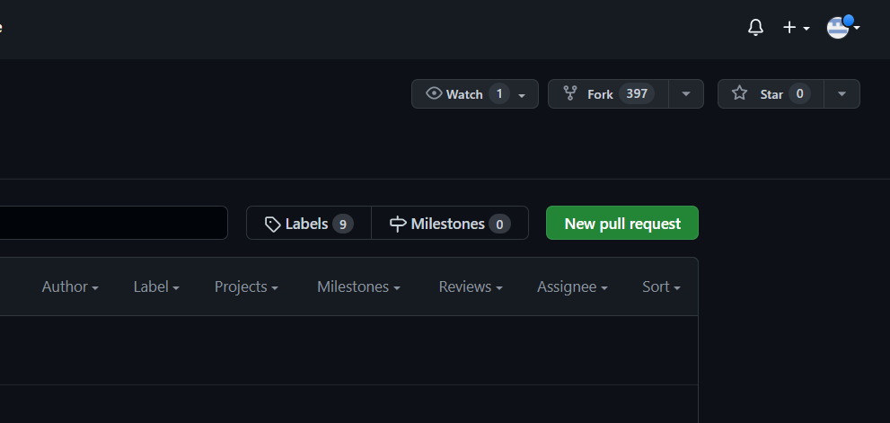

# Apa itu Fork ?
Fork adalah alat yang digunakan untuk mencopy repository orang lain dan diubah di dalam repository kita. 
   
# Pull request
Setelah kita edit atau ubah repository yang telah di-*fork*, kita dapat melakukan *pull request* agar pemilik asli dari repository tersebut dapat melihat perubahan yang kita lakukan dan dapat merubah repository asli
