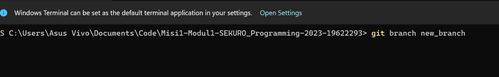
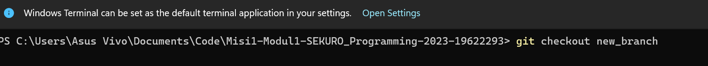
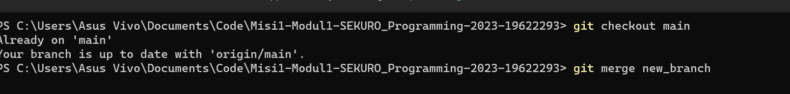

# Branch
Branch diibaratkan sebagai ranting dari batang utama pada sebuah pohon. Dalam hal ini, branch diguanakan sebagai simulasi dari branch utama atau *main* jika ditambahkan fitur baru  
# Membuat Branch
Untuk membuat branch, gunakan command *git branch <nama branch>*, seperti berikut

# Menggunakan Branch
Dalam praktiknya, akan terdapat banyak branch. Untuk menggunakan salah satunya, gunakan command *git checkout <Nama Branch>*. Contohnya seperti berikut:  

# Menggabungkan branch
Setelah yakin akan fitur baru pada branch dan ingin diimplementasikan pada branch utama atau branch yang lain, gunakan command *git merge <Nama Branch>* seperti berikut  
