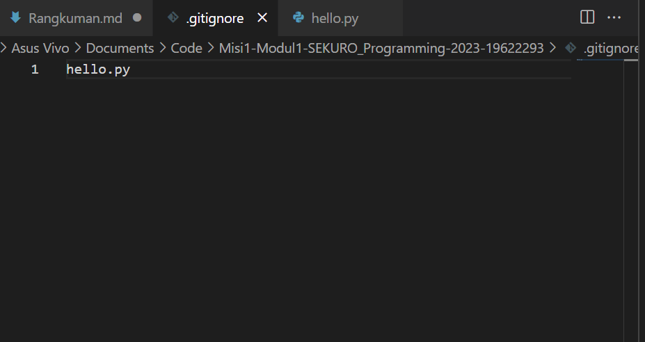

# .gitignore
 file dengan extension .gitignore adalah file dapat kita isi dengan nama file yang ingin diabaikan dan tidak dimasukkan   dalam repository  
 
   

 pada kasus di atas, file hello.py akan diabaikan